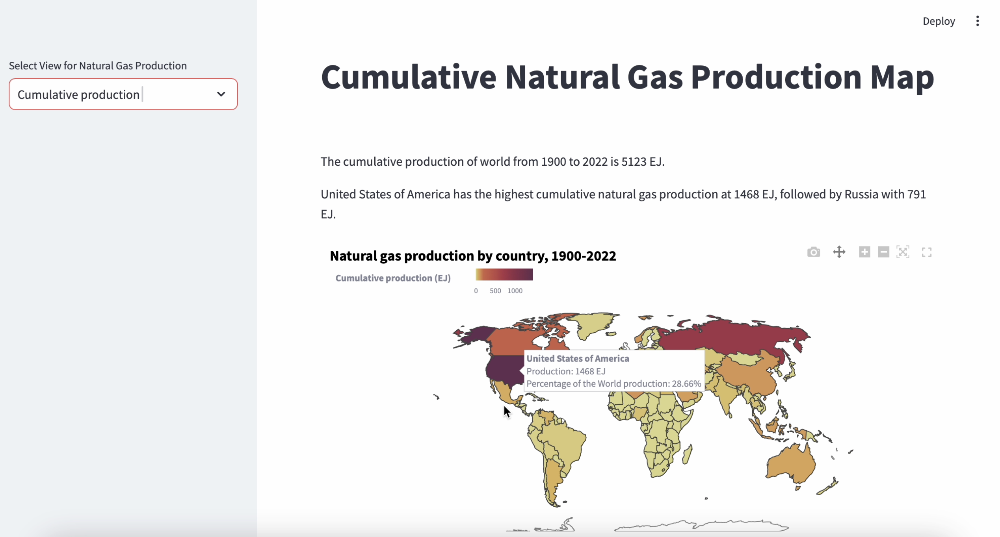
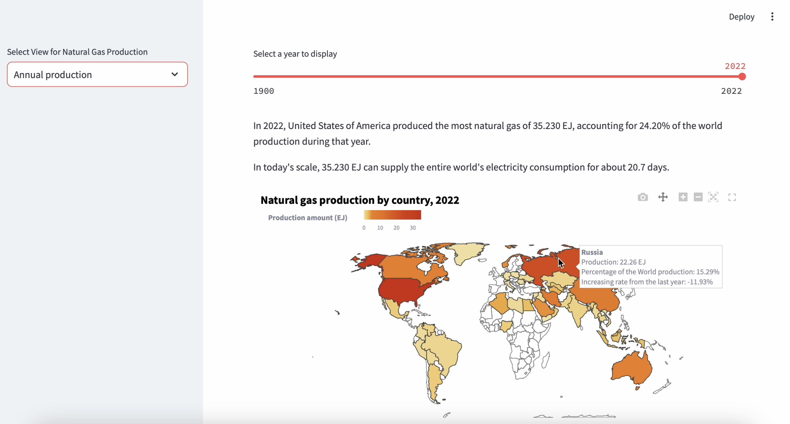
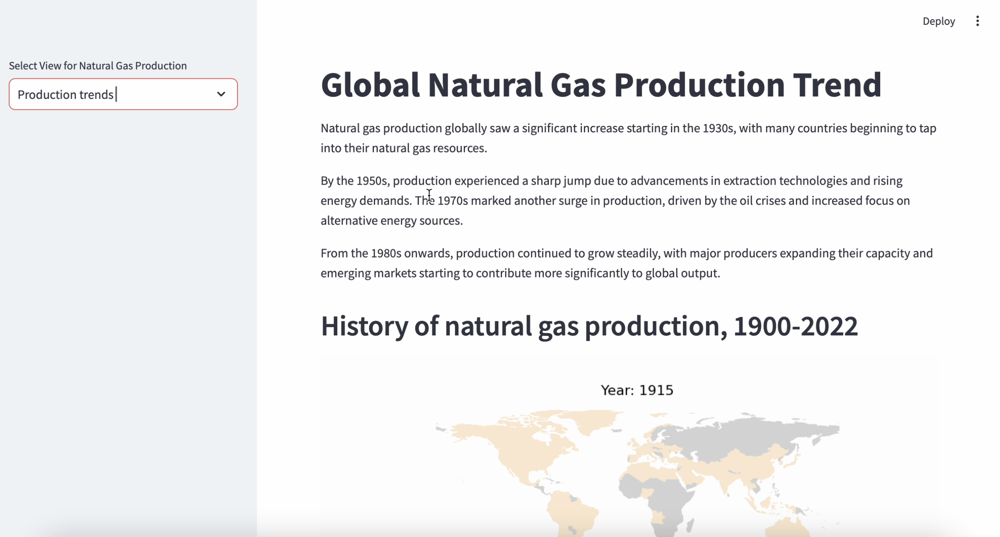
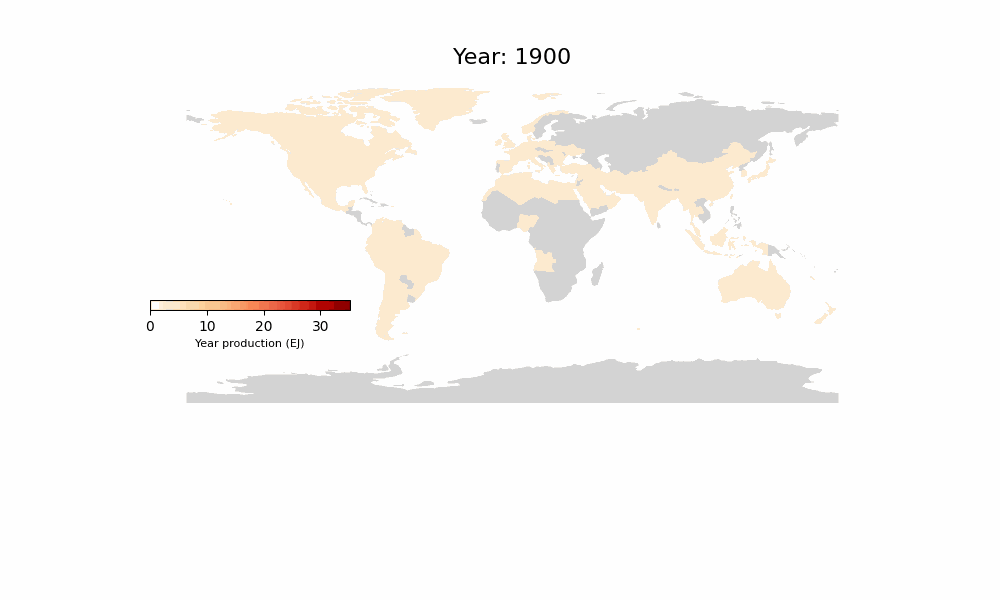

# Global Natural Gas Production Visualization
This project creates an interactive website to visualize global natural gas production data.

## Live Demo
The website is deployed on Streamlit Community Cloud. Check it out here:: [Website](https://natural-gas-map-website-eimbrmx5kh5senbrndfkax.streamlit.app)

## Features

- Selectable views in the sidebar: cumulative production (1900-2022), annual production, and production trends across countries (GIF format).
- Interactive filters and options for in-depth data exploration

## Screenshot of Website Views

1.	Cumulative Production: Overview of total output.

3.	Annual Production: Displayed using an interactive slider.

4.	Production Trend: Illustrated through an animated GIF.

5.  Gif for Production Trend

## Data Source

- The data for this visualization is sourced from: https://data.world/makeovermonday/week-27-what-to-watch-in-2024-energy.
- Map data is source from: https://www.naturalearthdata.com.

## Getting Started:

1. Clone this repository.
2. Install the required packages.
3. Run the application to launch the interactive website.
